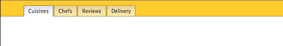

# Front End Foundations Session Two

## Homework

1. Continue the homework from last week ("Examine the provided homework samples for inspiration and try your hand at redesigning the page using the CSS techniques described in class). Add a JavaScript/CSS powered popover window to your page.

1. Review the steps we used to create a tab navigation interface

## Reading

* [Responsive Web Design](https://abookapart.com/products/responsive-web-design) - start it, carefully read the section on Media Queries

## Server Accounts

[See session one](https://github.com/front-end-foundations/session1)

## Styling a List with Floats



Review the navigation from last week.

In this exercise we will focus on list styling and navigation but instead of using `display: inline` or `display: inline-block` to create horizontal navigation we will use floats.

<!-- ## Demo in Sublime

* Install [package control](https://packagecontrol.io)

* Install [emmet](https://packagecontrol.io/packages/Emmet)

* Review [emmet syntax](http://docs.emmet.io/abbreviations/syntax/)

Using emmet -->

<!-- ```sh
!

ul>li*4>a[href="#"]{link}

nav>ul>li.t-cuisines*4>a[href="cuisines.html"]{cuisines}
``` -->

Create an HTML file and save it as `cuisines.html` into the `Tabs` folder.

<!-- * duplicate lines `cmd-d` and
* use multiple cursors `cmd` to complete the classes and links so you end up with: -->

```html
<!DOCTYPE html>
<html lang="en">
<head>
	<meta charset="UTF-8">
	<title>Cuisines</title>
	<style>

	</style>
</head>

<body>

<nav>
	<ul id="nav">
		<li class="t-cuisines"><a href="cuisines.html">Cuisines</a></li>
		<li class="t-chefs"><a href="chefs.html">Chefs</a></li>
		<li class="t-reviews"><a href="reviews.html">Reviews</a></li>
		<li class="t-delivery"><a href="delivery.html">Delivery</a></li>
	</ul>
</nav>

</body>
</html>
```

Take a moment to examine the default user agent styles using the inspector.

Add and review some basic formatting (in the `<style>` block):

```css
body {
	margin: 0;
	font-family: 'Lucida Grande', sans-serif;
}
#nav {
	background: #ffcb2d;
	margin: 0;
	padding: 10px 0 0 46px;
}
```

Firstly, remove the bullets from the `<ul>`:

```css
#nav {
	... list-style:none;
}
```

Then float the list items to the left (after removing the possibility that any margins or padding might be applied).

```css
li {
	float: left;
}
```

Notice what happened to the `<ul>`'s height. The `<li>` items no longer force the parent `<ul>` element to expand to contain them. This behavior, know as collapsing, occurs whenever all the direct children of a container element are floated. In this case the `<ul>` has collapsed. This behavior is important as collapsing is a common design issue.

There are a number of methods in use to prevent this:

* Apply CSS overflow: auto; to the collapsed element

* float a float (or "FNE" - float nearly everything) - apply a float to the collapsed element

* the clearfix hack - this entails creating a utility class and will be covered later

* adding a clearing div - this entails adding an HTML element to the page and is discouraged

For our current example let's use the second FNE method.

Try adding a float to the 'collapsed' element:

```css
#nav {
	... float:left;
}
```

Note that the width has changed. Boxes are 100% width by default (they stretch to fill their container). Floating the collapsed element causes it to contract to contain its children.

Since we want the `<ul>` to extend the width of the window let's fix the width.

```css
#nav {
	... width:100%;
}
```

_When you float an element you usually have to specify a width._

Extend the background property to add a background graphic to the `<ul>`.

```css
#nav {
	... background:#ffcb2d url(i/nav_bg.gif);
}
```

Aside: demo the background property using `pattern.gif`.

Add positioning to the background.

```css
#nav {
	... background:#ffcb2d url(i/nav_bg.gif) repeat-x bottom left;
}
```

Next we'll tackle the anchor tags: `<a>`. Add the following to our CSS block.

```css
a {
	text-decoration: none;
	color: #333;
}
```

Adding padding, margins to separate, and a border to make them more tab-like:

```css
a {
	...
	padding: 4px 8px;
	border: 1px solid #9b8748;
	margin: 0 6px 0 0;
}
```

Although it may be a little difficult to discern, the same issue we had with collapsing earlier has occurred here as well. We will use the same method as before to make the container expand to fit its floated children. Let's remove the redundant border while we're at it.

```css
a {
	...
	border-bottom: none;
	float: left;
}
```

By floating the anchors we cause the list items to expand to contain their floated children.
Now we add a background image to the <a>. Note that the image has a gradient and transparency.

```
a {
	...
	background: #f9eaa9 url(i/off_bg.gif) repeat-x top left;
```

Note what happened to the background graphic we placed in the `<ul>`. It is hidden behind the (now not transparent) anchors.

Now we create hover states for our tabs by swapping out the background image:

```css
a:hover {
	background: #fff url(i/on_bg.gif) repeat-x top left;
}
```

### Finishing touches

This part is a but tricky since it uses padding to show or hide the background graphic running along the bottom of the `<ul>`. We will be increasing the height by one pixel on hover to hide the image.

Recall that the padding on the bottom of the anchor tags was 4px. Let's increase the padding on the hover state to 5px.

```css
a:hover {
	... padding-bottom:5px;
}
```

If you roll over the tabs now the height of the anchor increases by one pixel causing the `<ul>` to expand as well and thus showing the border along the bottom under the inactive tabs.

Due to the fact that there is no selected tab (only hovered) the height of the element appears to jump slightly. Let's assume that one of the tabs will always be highlighted.

Create a second selector to highlight one of the anchors.

```css
a:hover,
.t-cuisines a {
	...;
}
```

Note that when you use two selectors they must be separated by a comma.

Many prefer to keep the multiple selectors on separate lines like so:

```css
a:hover,
.t-cuisines a {
	...;
}
```

Now, if we add an id to the body tag we can edit the selector to make it page specific.
Add id="cuisines" to the body tag.

```html
<body id="p-cuisines">
```

Edit the second selector to make the tab highlighting specific to this page.

```css
a:hover,
#p-cuisines .t-cuisines a {
	...;
}
```

We are going to create a second HTML page shortly so let's copy our CSS into an external file, save it as styles.css, and link to it from a newly created css directory:

```html
<link href="css/styles.css" rel="stylesheet" type="text/css">
```

Note that because we used a new directory, the paths to the images are no longer correct. Correct them now.

Save a new copy of the HTML page as chefs.html and edit the ID:

```html
<body id="chefs">
```

Add a new selector to the CSS.

```css
a:hover,
#p-cuisines .t-cuisines a,
#p-chefs .t-chefs a {
	...;
}
```

Now when you navigate between the two pages you should see a friendly reminder of what page you are on courtesy of the CSS file.

* There is a demo of this in the `Tabs > demo` directory.

### Removing the on- off- images

Images and any other externally linked asset increases the time it takes to download and render your page. It is considered a best practice to minimize the number of images whereever possible so let's remove as many as we can.

Aside: [Hex color vs. RGB vs. RGBA](https://www.w3schools.com/colors/colors_converter.asp)

* [Intro to gradients in css](https://css-tricks.com/css3-gradients/) has more information than you'll ever need
* The [Gradient editor](http://www.colorzilla.com/gradient-editor/) is still a useful tool

Edit the background properties for the tabs:

Normal (eg. non-hovered) state:

```
background-image: linear-gradient(to bottom, rgba(255,236,165,1) 0%,rgba(232,213,149,1) 6%,rgba(253,233,162,1) 94%,rgba(253,233,162,1) 100%);
```

Highlighted (eg. hovered) state:

```
background-image: linear-gradient(to bottom, rgba(255,255,255,1) 0%,rgba(224,226,240,1) 6%,rgba(254,254,254,1) 53%);
```

Underline:

```
background-image: linear-gradient(to bottom, #ffcb2d 0%,#ffcb2d 96%,#9b8748 100%);
```

## Looking Forward

Examine the other demos in the `demo` folder.

# Exercise - Converting to Standards

Open before.html in an editor and examine the HTML. Then examine index.html. The latter is an html5 document that uses HTML tags semantically. The former is often referred to as tag soup as it makes little sense to humans looking at the code.

Examine index.html in the browser inspector to display the default (user agent) styling. Note the defaults for margins and padding used to display the body and the unordered list (`<ul>`).

## Terminal

```sh
$ cd <path-to-folder>
$ python -m SimpleHTTPServer 9000
```

Add a CSS block within the `<head>`of index.html as follows:

```html
<style>
    body {
        margin: 0;
        color: #333;
        font-family: Verdana, Arial, sans-serif;
    }
</style>
```

## Google fonts

Google has a CDN offering (free fonts)[https://fonts.google.com] for use in HTML documents. We'll use this as an example of using external stylesheets via @import and the `<link>` tag.

We will use [Lato](https://fonts.google.com/specimen/Lato) for our main text and [Lobster](https://fonts.google.com/specimen/Lobster) for our branding.

### Linking to a css file from css

```
@import url('http://fonts.googleapis.com/css?family=Lato:300,400,700');
```

Add this to the top of our css (@import statements should always come first) to use the font within our stylesheet. Add to the body css rule:

```
font-family: 'Lato', sans-serif;
```

### Linking to a css file from html

THe html link tag:

```html
<link href="https://fonts.googleapis.com/css?family=Lobster" rel="stylesheet">
```

in use:

```css
header {
	font-family: 'Lobster', cursive;
	font-weight: normal;
}
```

Note the bold property belongs to the H1 tag, not the header tag.

```css
header h1,
header h2 {
	font-weight: normal;
}
```

Note the use of weights in Lato:

```
h2 {
  font-weight: 300;
}
```

## Formatting the Navigation

Add a _class_ to the `<ul>` that will form the navigation for our page.

```html
<ul class="nav">
    <li><a href="#">Cuisines</a></li>
    ...
</ul>
```

By doing so we have created a name space that allows us to differentiate the two `<ul>` lists in `start.html` and apply two different styles.

Add the following to our style block:

```css
.nav {
	list-style: none;
	padding: 0;
}
.nav li {
	display: inline-block;
	margin-right: 10px;
}
.nav a {
	color: #fff;
	text-decoration: none;
	padding: 4px;
	display: block;
	background-color: #600;
}
.nav a:hover {
	color: #222;
	background-color: #bada55;
}
```

Examine display options for making the buttons horizontal using block, float, inline-block, and flex.

Examine the inspector's color picker. Note the ability to force element hover state.

Add css to `nav a`:

```
transition: all 0.5s linear;
```

Edit the animation using the inspector's animation settings.

To animate only one difference specify it instead of `all`:

```
transition: background-color 0.5s linear;
```

## Absolutely Positioning the Navigation

_Edit_ the nav CSS rule to position it

```css
.nav {
	list-style: none;
	padding: 0;
	position: absolute;
	right: 0;
	top: 60px;
}
```

Add an `<aside>` tag around the table and list then add the following CSS:

```css
aside {
	position: absolute;
	top: 200px;
	left: 10px;
	width: 180px;
	background-color: #f0dfb4;
	padding: 6px;
	border: 1px solid #600;
}
```

Note how the text flows under the aside.

Add margin to move the article over to the right:

```css
article {
	margin: 0 20px 0 240px;
}
```

The four values for margin run clockwise from the top.

<!-- ### CSS Variables

(These)[https://developer.mozilla.org/en-US/docs/Web/CSS/Using_CSS_variables] allow us to store commonly used information as a variable for use throughout our css.

```
html {
  --bg-color: #f0dfb4;
}
```

```
.nav a {
  ...
  background-color: var(--bg-color);
}

aside {
  ...
  background-color: var(--bg-color); 
}
``` -->

### Floating

Format the pull quote and image:

```css
blockquote {
	float: right;
	width: 40%;
	padding: 16px;
	font-size: 24px;
}
article img {
	float: right;
}
```

Note the float property and how the text wraps around it before and after we have defined a width. By default, the floated container shrinks to the width determined by the content.

## Converting the document to fixed width

Currently our document flexes as we make the browser wider to makes use of all the available horizontal space. While flexibility is generally a good practice, most sites use fixed widths to improve readability. cf [Wikipedia](https://en.wikipedia.org/wiki/Line_length) vs [The Guardian](https://www.theguardian.com)

Add wrapper `<div id="wrapper">` to entire content area (after the `<body>` tag and close it before the closing `</body>` tag) and add the following to our CSS style block.

```css
#wrapper {
	width: 840px;
}
```

vs.

```css
#wrapper {
	max-width: 840px;
}
```

Then center it in the browser.

```css
#wrapper {
	max-width: 840px;
	margin: 0 auto 0 auto;
	border: 1px solid #999;
}
```

Add a relative positioning instruction.

```css
#wrapper {
	position: relative;
	...;
}
```

Note the impact the relative positioning has on the layout (toggle it on and off using the inspector). The two absolutely positioned elements (aside and .nav) previously had no positioning context and aligned themselves to the edges of the browser window. With the addition of the relative positioning to the wrapper they now become positioned relative to the wrapper box. The rule here is that absolutely positioned elements are positioned relative to their nearest positioned ancestor in the HTML tree. This is an important CSS design pattern and well will see it again.

## Adding color to our layout

Edit the CSS body rule.

```css
body {
	
: #ddd;
}
```

Note that the wrapper's background is transparent and shows through to the gray applied to the body.

Let's add a white background to wrapper.

```css
#wrapper {
	...
    background-color: #fff;
}
```

Note the body background color is grayed out in the inspector. Neither it nor the margin are inherited by other elements.

## Formatting the content

Note the h1's margin outside the containing elements (not part of the box model).

```css
h1,
h2 {
	color: #600;
	margin-top: 20px;
	margin-left: 20px;
	font-size: 3rem;
	margin-bottom: 0;
}
h2 {
	font-size: 32px;
	margin-top: 0;
}
```

Note - selector strength here. Note that the lack of namespacing allows this to effect the Matsu text as well.

Format elements in the list and table

```css
aside th {
	text-align: right;
}

aside ul {
	list-style: none;
	margin: 1em;
	padding: 0;
}
```

### Inline, In Page & External CSS

We've already seen the link tag and @import methods of adding css to our document. Let's examine all the ways to add CSS to an HTML document:

* Inline via the HTML `style=` attribute
* In page via the HTML `<style>` tag
* As an external .CSS file via linking (HTML `<link>` tag)
* As an external .CSS file via importing (CSS `@import` statements)

Inline styles are inefficient:

```html
<p style="margin-top: 12px;">
```

However, this method is often used when dynamically changing the page after it has been loaded in the browser.

Try using the inspector to inspect a dynamic page (such as http://www.w3schools.com/jquery/jquery_animate.asp). Note how it displays animation by temporarily highlighting inline css in purple.

Remove the CSS from the head of the document and paste it into a new text document. Save it in a new css directory calling it styles.css. We have two options here: link to our CSS file using an HTML tag, or to use a CSS @import statement.

```html
<link href="css/styles.css" media="all" />
```

Try not to use the alternative:

```html
<style>
  @import url("css/styles.css");
</style>
```

Note: ideally, all your stylesheets should be in one file to reduce the number of requests the browser needs to make to the server (a major cause of slow loading sites).

## Some simple CSS3 Enhancements

As work on a new version of CSS progressed it was found that releasing an entirely new specification would be too cumbersome so the standards committee (http://W3C.org) decided to break the process into modules. (For compatibility and advice see http://CanIuse.com.)

Some of the earlier CSS 3 specifications include provisions for visual effects such as rounded corners, drop shadows and gradients. A useful page that allows you to become familiar with these enhancements is http://css3generator.com/.

Add rounded corners to the info div. (See https://developer.mozilla.org/en/CSS/border-radius for specifications.)

```css
aside {
	...
    border-radius: 6px;
}
```

Add a drop shadow to the CSS for the info div using the inspector (...).

```css
aside {
	
: 3px 4px 3px 2px #d6d6d6;
}
```

Add a box shadow to the wrapper's CSS:

```
box-shadow: 10px 10px 20px #ddd;
```

<!-- Add CSS 3 Gradients. (See: http://www.colorzilla.com/gradient-editor/) -->

## Highlight one of the tabs

This is a simple way to create color coded navigation on a web site.
Add a class to body tag so we know what kind of page this is.

```html
<body class="p-review">
```

Add a list item to the nav list with a class of review-link.

```html
<li><a class="t-review" href="#">Reviews</a></li>
```

Add the following to our CSS block:

```css
.review-page .review-link {
    color: #fff;
    background:#600;

}
```

Note that the tab is now highlighted.

### Adding Simple Responsiveness

At the bottom of the stylesheet

```css
@media print {
	* {
		display: none !important;
	}
}

@media all and (max-width: 800px) {
	.nav {
		top: 0;
		left: 0;
		margin: 0;
	}
	aside {
		position: static;
		float: left;
		margin-right: 20px;
	}
	article {
		margin-left: 20px;
	}
	blockquote {
		width: 100%;
		float: none;
		margin: 0;
	}
}
```

### Using Flexbox (optional - demo only)

```css
.nav {
	display: flex;
	padding: 0;
}
.nav li {
	flex: 1;
	background-color: #f0dfb4;
	list-style: none;
}
```

```css
.nav {
	display: flex;
	padding: 0;
}
.nav li {
	flex: 1;
	background-color: #d00;
	list-style: none;
	text-align: center;
}
```

* create a separate css file and link it back to the document

### CSS Variables

(These)[https://developer.mozilla.org/en-US/docs/Web/CSS/Using_CSS_variables] allow us to store commonly used information as a variable for use throughout our css.

See also [Can I Use](https://caniuse.com/#search=css%20variables)

```
html {
  --bg-color: #f0dfb4;
}
```

```
.nav a {
  ...
  background-color: var(--bg-color);
}

aside {
  ...
  background-color: var(--bg-color);
}
```

## Responsive Design

```
@media print {
	* {
		display: none !important;
	}
}
```

```
@media screen and (max-width: 800px){
	.nav {
		top: 0;
		left:0;
		margin: 0;
		background: var(--rust);
	}
	header {
		padding-top: 30px;
	}
	aside {
		position: static;
		float: left;
		margin-right: 20px;
	}
	article {
		margin-left: 20px;
	}
	blockquote {
		width: 100%;
		float: none;
		margin: 0;
	}
}
```

## DOM Scripting I

* The console and variables

Try this in the console (copy paste one line at a time):

```js
var width = 100;
width;
typeof width;
width + 300;
width;
width + 'test';
var width = 200;

let wide = true;
wide;
typeof wide;
let wide = false;
wide = false;

const testString = '123456';
testString;
typeof testString;
const testString = 'abcde';
```

* Selecting items with [querySelector](https://developer.mozilla.org/en-US/docs/Web/API/Document/querySelector), see also [querySelectorAll()](https://developer.mozilla.org/en-US/docs/Web/API/ParentNode/querySelectorAll) (we'll work with this later)

* attaching events with [addEventListener('event', function)](https://developer.mozilla.org/en-US/docs/Web/API/EventTarget/addEventListener), see also [event types](https://developer.mozilla.org/en-US/docs/Web/Events)

* [Functions](https://developer.mozilla.org/en-US/docs/Glossary/Function)

* Manipulating HTML with [classList](https://plainjs.com/javascript/attributes/adding-removing-and-testing-for-classes-9/)

Add link to a [Google map](https://www.google.com/maps/place/Geido/@40.6778979,-73.9749227,17z/data=!3m1!4b1!4m5!3m4!1s0x89c25ba8edab126b:0xfaa0551477e2ec72!8m2!3d40.6778939!4d-73.972734):

```
https://www.google.com/maps/place/Geido/@40.6778979,-73.9749227,17z/data=!3m1!4b1!4m5!3m4!1s0x89c25ba8edab126b:0xfaa0551477e2ec72!8m2!3d40.6778939!4d-73.972734
```

e.g.:

```html
<li><a class="map" target="_blank" href="https://www.google.com/maps/place/Geido/@40.6778979,-73.9749227,17z/data=!3m1!4b1!4m5!3m4!1s0x89c25ba8edab126b:0xfaa0551477e2ec72!8m2!3d40.6778939!4d-73.972734">Map</a> | <a href="#">Directions</a></li>
```

Add a class of `.map` to the map link

```
<script>
	var mapClicker = document.querySelector('.map')

	mapClicker.addEventListener('click', show)
	// document.addEventListener('click', show)

	function show(){
		event.preventDefault()
	};
</script>
```

Add to the bottom of the html (but before `<script>`):

```
<div class="popover">
	<iframe src="https://www.google.com/maps/embed?pb=!1m18!1m12!1m3!1d3025.821674756671!2d-73.97492268461596!3d40.67789794763805!2m3!1f0!2f0!3f0!3m2!1i1024!2i768!4f13.1!3m3!1m2!1s0x89c25ba8edab126b%3A0xfaa0551477e2ec72!2sGeido!5e0!3m2!1sen!2sus!4v1490213487125" width="300" height="225" frameborder="0" style="border:0" allowfullscreen></iframe>
</div>
```

```
.popover {
	padding: 1rem;
	width: 300px;
	height: 225px;
	background: #fff;
	border: 1px solid var(--rust);
	border-radius: var(--radius);
	position: fixed;
	top: calc(50% - 100px);
	left: calc(50% - 150px);
	/*display: none;*/
}
```

Uncomment `display: none` so the map stays hidden.

Add a new rule to the css:

```
.showme {
	display: block;
}
```

```
<script>
	var mapClicker = document.querySelector('.map')
	var popOver = document.querySelector('.popover')
	mapClicker.addEventListener('click', show)

	function show(){
		popOver.classList.toggle('showme')
		event.preventDefault()
	};
</script>
```

Notes
